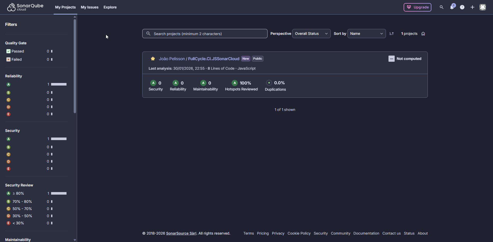

#  FullCycle.CI.JSSonarQube

> 🇺🇸 **English** | 🇧🇷 **Português**

---

## 🇺🇸 English

This repository is part of the **Continuous Integration (CI)** track from **@FullCycle** and demonstrates **how to implement code quality analysis with SonarQube Cloud in a JavaScript application** using [SonarCloud](https://sonarcloud.io/) integrated with GitHub Actions.

---

### 🎯 Repository Purpose

**code quality analysis with SonarQube Cloud**, covering practical scenarios such as:

- SonarQube Cloud setup and configuration
- Integration with JavaScript/Node.js applications
- GitHub Actions CI/CD pipeline
- Code coverage analysis and reporting
- Quality gates and metrics
- SonarCloud best practices

---

### ⚙️ Key Concepts & Approaches

- **SonarQube Core Concepts**
  - Code quality metrics
  - Security and reliability analysis
  - Maintainability index
  - Technical debt detection

- **Local Installation**
  - Docker-based SonarQube setup
  - Project configuration
  - Token management and security

- **Code Coverage**
  - JavaScript test coverage reporting
  - Integration with SonarQube
  - Coverage visualization and trends

---

### 📊 Preview

---

## 🇧🇷 Português (PT-BR)

Este repositório faz parte da trilha **Continuous Integration (CI)** do **@FullCycle** e demonstra **como implementar análise de qualidade de código com SonarQube Cloud em uma aplicação JavaScript** utilizando [SonarCloud](https://sonarcloud.io/) integrado com GitHub Actions.

---

### 🎯 Objetivo do Repositório

**análise de qualidade de código com SonarQube Cloud**, abordando cenários práticos como:

- Setup do SonarCloud e configuração
- Integração com aplicações JavaScript/Node.js
- Pipeline CI/CD com GitHub Actions
- Análise e relatório de cobertura de testes
- Quality gates e métricas
- Boas práticas do SonarCloud

---

### ⚙️ Principais Conceitos e Abordagens

- **Conceitos Principais do SonarQube**
  - Métricas de qualidade de código
  - Análise de segurança e confiabilidade
  - Índice de manutenibilidade
  - Detecção de débito técnico

- **SonarCloud na Nuvem**
  - Configuração do SonarCloud
  - Integração com GitHub Actions
  - Gestão de tokens e segurança
  - Pipeline CI/CD automatizado

- **Cobertura de Código**
  - Relatório de cobertura de testes JavaScript
  - Integração com SonarCloud
  - Visualização e tendências de cobertura

---

### 📊 Preview

